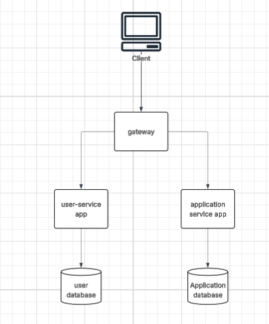

# Job Tracker API

A microservices-based REST API for tracking job applications, built with Spring Boot 4 and Spring Cloud Gateway. Demonstrates service decomposition, reactive API gateway with JWT authentication, and containerised deployment with Docker Compose.

> **Monolith branch**: The original single-service implementation is preserved on the [`monolith-branch`](https://github.com/subratokha/job-tracker-api/tree/monolith-branch) branch — showing the architectural progression from monolith to microservices and the decisions that drove the split.

---
## Architecture Overview

The application follows a microservices architecture with Spring Cloud Gateway acting as the single entry point. Authentication is centralized at the gateway using JWT validation, while each service owns its own database to maintain clear service boundaries and independent deployment.



### Architecture Decisions

- **Gateway-level JWT validation** — the gateway is the external security boundary for API requests. Downstream services trust the `X-User-Id` header injected by the gateway after token validation. Services contain no JWT logic. Business-level authorization, such as ensuring users can only access their own job applications, remains inside the Application Service.
- **Service-per-database isolation** — user-service and application-service each own a dedicated PostgreSQL instance. application-service references users by `userId` (a plain `Long`) rather than a cross-service entity relationship.
- **Reactive gateway, servlet services** — the gateway uses Spring WebFlux (Netty) for non-blocking request routing. The business services use Spring MVC (Tomcat) with Spring Data JPA — the right stack for each concern.
- **Shared JWT library** — token generation and validation logic lives in `jwt-common`, a shared Maven module. No duplication across services, no inter-service calls for validation.

### Monolith branch

The [`monolith-branch`](https://github.com/subratokha/job-tracker-api/tree/monolith-branch) contains the original single-service implementation with the same domain model. The split was driven by: independent deployability, database ownership per service, and removing JWT validation from business logic into infrastructure.

---

## Tech Stack

| | Technology |
|---|---|
| Language | Java 21 |
| Framework | Spring Boot 4.0.6 |
| Gateway | Spring Cloud Gateway 2025.1 (WebFlux / Netty) |
| Security | Spring Security, JWT (jjwt 0.12.6) |
| Persistence | Spring Data JPA, Hibernate, PostgreSQL 16 |
| Build | Maven (multi-module monorepo) |
| Containerisation | Docker, Docker Compose |
| API Docs | SpringDoc OpenAPI 3 (aggregated at gateway) |
| Testing | JUnit 5, Mockito, MockMvc, DataJpaTest, H2 |
| CI | GitHub Actions |

---

## Quick Start (Docker)

The entire stack — gateway, two services, two databases — starts with a single command.

### Prerequisites

- Docker and Docker Compose

### Setup

1. Clone the repository:
```bash
git clone https://github.com/subratokha/job-tracker-api.git
cd job-tracker-api
```

2. Create your `.env` file from the example:
```bash
cp .env.example .env
```

3. Edit `.env` with your values:
```env
USER_SERVICE_DB_USERNAME=postgres
USER_SERVICE_DB_PASSWORD=your-secure-password
APPLICATION_SERVICE_DB_USERNAME=postgres
APPLICATION_SERVICE_DB_PASSWORD=your-secure-password
USER_SERVICE_JWT_SECRET=your-secure-jwt-secret-key
```

4. Start the full stack:
```bash
docker compose up --build
```

### What starts

| Container | Role | Port |
|---|---|---|
| `gateway-service-app` | API Gateway (public entry point) | `8080` |
| `user-service-app` | Authentication and user management | `8081` (internal only) |
| `application-service-app` | Job application CRUD | `8082` (internal only) |
| `postgres-user-service` | User Service database | `5432` (internal only) |
| `postgres-application-service` | Application Service database | `5432` (internal only) |

### Access

| What | URL |
|---|---|
| API | `http://localhost:8080` |
| Swagger UI (aggregated) | `http://localhost:8080/swagger-ui/index.html` |

> **Note:** Only the gateway is publicly exposed. All services and databases communicate over the internal Docker network.

---

## Local Development

Run individual services locally for debugging or active development.

### Prerequisites

- Java 21
- Maven (provided via `./mvnw`)
- Docker (for Postgres containers)

### Start Postgres containers

Each service has its own database. Start them with values matching your `application-local.properties`:

```bash
# User Service database
docker run -d \
  --name postgres-user-service \
  -e POSTGRES_PASSWORD=${your_password} \
  -e POSTGRES_DB=user_service \
  -p 5433:5432 \
  postgres:16

# Application Service database
docker run -d \
  --name postgres-application-service \
  -e POSTGRES_PASSWORD=${your_password} \
  -e POSTGRES_DB=application_service \
  -p 5434:5432 \
  postgres:16
```

> Each service reads database credentials from its own git-ignored `application-local.properties`. Set `POSTGRES_PASSWORD` here to match what you configure there.

### Run each service

Each service reads local config from its own `application-local.properties` (git-ignored). These files are pre-configured for the Postgres containers above.

Open three terminals:

**Terminal 1 — User Service (port 8081):**
```bash
cd user-service
../mvnw spring-boot:run -Dspring-boot.run.profiles=local
```

**Terminal 2 — Application Service (port 8082):**
```bash
cd application-service
../mvnw spring-boot:run -Dspring-boot.run.profiles=local
```

**Terminal 3 — Gateway (port 8080):**
```bash
cd gateway
../mvnw spring-boot:run -Dspring-boot.run.profiles=local
```

### Service URLs (local)

| Service | URL |
|---|---|
| Gateway | `http://localhost:8080` |
| User Service (direct) | `http://localhost:8081` |
| Application Service (direct) | `http://localhost:8082` |
| Swagger UI (aggregated) | `http://localhost:8080/swagger-ui/index.html` |

> **Note:** In local development, services are directly accessible on their own ports. In Docker, only the gateway is exposed.

---

## API

All requests go through the gateway at `http://localhost:8080`.

Interactive documentation with request/response examples is available at:
```
http://localhost:8080/swagger-ui/index.html
```
The Swagger UI aggregates both User Service and Application Service endpoints in a single dropdown.

### Authentication

| Method | Path | Auth | Response |
|---|---|---|---|
| `POST` | `/auth/register` | Public | `201 Created` |
| `POST` | `/auth/login` | Public | `200 OK` with JWT |

Register request:
```json
{
  "firstName": "Ada",
  "lastName": "Lovelace",
  "email": "user@example.com",
  "password": "password123"
}
```

Login response:
```json
{
  "token": "<jwt>"
}
```

### Job Applications

All `/applications` endpoints require:
```http
Authorization: Bearer <jwt>
```

| Method | Path | Response |
|---|---|---|
| `GET` | `/applications` | `200 OK` — current user's applications |
| `POST` | `/applications` | `201 Created` with `Location: /applications/{id}` |
| `GET` | `/applications/{id}` | `200 OK` |
| `PUT` | `/applications/{id}` | `204 No Content` |
| `DELETE` | `/applications/{id}` | `204 No Content` |

Create/update request:
```json
{
  "companyName": "Example Corp",
  "jobTitle": "Backend Engineer",
  "jobUrl": "https://example.com/jobs/backend-engineer",
  "contactName": "Recruiter Name",
  "dateApplied": "2026-01-02",
  "lastFollowUpDate": "2026-01-09",
  "status": "APPLIED",
  "notes": "Applied via careers page"
}
```

Supported statuses: `SAVED`, `APPLIED`, `INTERVIEWING`, `OFFERED`, `REJECTED`

### Error responses

```json
{
  "status": 400,
  "message": "field: validation message",
  "timestamp": "2026-06-12T12:00:00"
}
```

| Status | Cause |
|---|---|
| `400 Bad Request` | Validation failure |
| `401 Unauthorized` | Missing or invalid JWT |
| `404 Not Found` | Application not found for current user |
| `409 Conflict` | Email already registered |
| `500 Internal Server Error` | Unhandled exception |

---

## Project Structure

Multi-module Maven monorepo. Each service is independently buildable and deployable.

```
job-tracker-api/
├── jwt-common/                         Shared JWT library (generation + validation)
│   └── src/main/java/com/jobtracker/jwt/
│       └── JwtService.java
│
├── user-service/                       Authentication and user management (port 8081)
│   ├── src/main/java/com/jobtracker/user/
│   │   ├── controller/                 AuthController
│   │   ├── service/                    UserService, CustomUserDetailsService
│   │   ├── repository/                 UserRepository
│   │   ├── model/                      User, Role
│   │   ├── dto/                        RegisterRequest, AuthRequest, AuthResponse
│   │   ├── exception/                  GlobalExceptionHandler, custom exceptions
│   │   └── security/                   SecurityConfig
│   ├── Dockerfile
│   └── pom.xml
│
├── application-service/                Job application CRUD (port 8082)
│   ├── src/main/java/com/jobtracker/application/
│   │   ├── controller/                 JobApplicationController
│   │   ├── service/                    JobApplicationService
│   │   ├── repository/                 JobApplicationRepository
│   │   ├── model/                      JobApplication, ApplicationStatus
│   │   ├── dto/                        JobApplicationRequest, JobApplicationResponse
│   │   └── exception/                  GlobalExceptionHandler, ResourceNotFoundException
│   ├── Dockerfile
│   └── pom.xml
│
├── gateway/                            API Gateway — routing + JWT validation (port 8080)
│   ├── src/main/java/com/jobtracker/gateway/
│   │   ├── JwtAuthFilter.java          Reactive WebFilter — validates JWT, injects X-User-Id
│   │   └── SecurityConfig.java         WebFlux security configuration
│   ├── src/main/resources/
│   │   └── application.yml             Routes, SpringDoc aggregation config
│   ├── Dockerfile
│   └── pom.xml
│
├── docker-compose.yml                  Orchestrates all 5 containers
├── .env.example                        Environment variable template
└── pom.xml                             Parent pom — manages all modules
```

### Module dependency

```
user-service       ──► jwt-common
gateway            ──► jwt-common
application-service    (no jwt-common dependency — JWT handled by gateway)
```

---

## CI/CD

GitHub Actions pipeline runs on every push and pull request to `main`.

### Pipeline

```yaml
on:
  push:
    branches: [main]
  pull_request:
    branches: [main]
```

**Jobs:**

1. **Build and test** — compiles all modules and runs the full test suite
2. **Package** — builds executable JARs for all services (`-DskipTests`)

Tests run against H2 in-memory database — no Postgres required in CI.

### Run tests locally

```bash
# Run tests for all modules from repo root
./mvnw clean test

# Run tests for a specific service
./mvnw -pl user-service -am clean test
```
